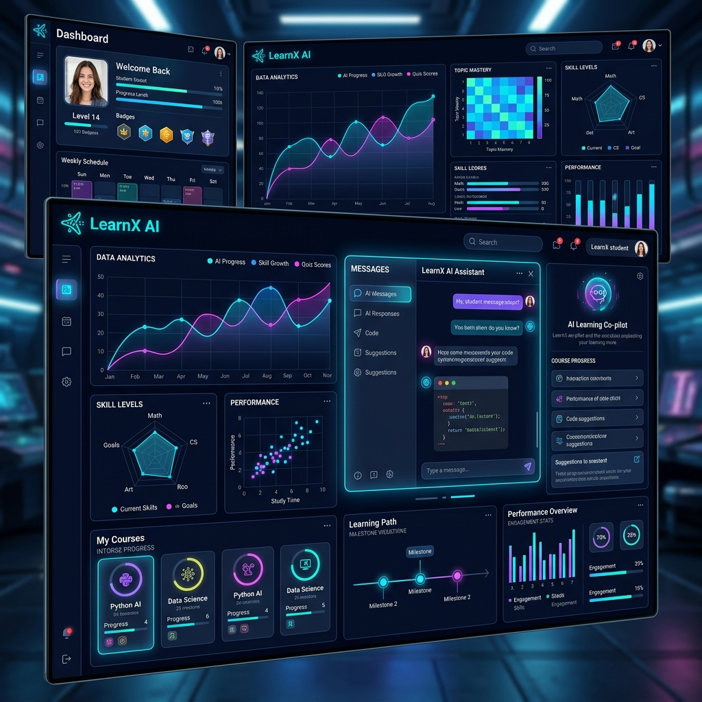

# 
 LearnX AI: The Digital Curator Framework

  
  
  
  

---

## 🌌 Overview
**LearnX AI** is a state-of-the-art, high-fidelity mock-environment built to redefine the boundaries of academic intelligence. Designed with a **Glassmorphic Dark-Themed Aesthetic**, this platform serves as a "Digital Curator," synthesizing raw educational materials into personalized, high-retention learning paths.

This project is a comprehensive collection of **14 high-end UI mock screens**, meticulously crafted to demonstrate a seamless synergy between students, faculty, and institutional administrators.

---

## ✨ Features at a Glance

### 🎓 For Students (Explorers)
- **AI Student Dashboard**: A central hub to track learning velocity, progress, and insights.
- **Micro-Learning Interface**: Intelligent chatbot and material curation interface.
- **Adaptive Quizzes**: Real-time evaluation engines that evolve with your cognitive performance.
- **Digital Brain**: Saved notes and insight library for permanent knowledge retention.

### 🏫 For Faculty (Architects)
- **Faculty Dashboard**: Orchestrate content modules and monitor student engagement analytics.
- **Knowledge Synthesis Hub**: Upload and process research papers, PDFs, and lectures with AI.
- **Creative Quiz Builder**: High-fidelity AI quiz generation and performance monitoring.

### 🏢 For Admin (Controllers)
- **Central Management Console**: Enterprise-grade oversight of institutional ecosystems.
- **User Auditing**: Behavioral management and cross-role system performance monitoring.
- **Data Governance**: Secure management of digital assets and curatorial frameworks.

---

## 🖼️ Mock Screens Library

This repository contains the following high-fidelity mockups:

| Module | Purpose | Directory |
| :--- | :--- | :--- |
| **Landing Page** | The public entrance to the Digital Curator Framework. | `learnx_ai_landing_page/` |
| **Login/Registration** | Premium, seamless entry points with glassmorphic depth. | `learnx_ai_login_page/`, `learnx_ai_registration_page/` |
| **Student Dashboard** | High-density data visualization and active learning hub. | `learnx_ai_student_dashboard/` |
| **Faculty Hub** | Control center for content architects and educators. | `learnx_ai_faculty_dashboard/`, `faculty_creation_hub/` |
| **Admin Console** | Institutional oversight and system-wide analytics. | `admin_dashboard_learnx_ai/`, `user_management_admin_console/` |
| **AI Chatbot** | Interactive neural assistant for real-time synthesis. | `learnx_ai_chatbot_interface/` |
| **Active Quiz** | High-performance testing session with real-time feedback. | `ai_quiz_active_session/`, `quiz_results_summary/` |
| **Knowledge Engine** | Content uploading and synthesis interface. | `learnx_ai_material_upload/` |
| **Insight Library** | Personalized digital second brain for saved insights. | `saved_notes_learnx_ai/` |

---

## 🛠️ Technical Implementation
The mock ecosystem is built using a modern, lightweight, and high-performance stack:
- **Core Stucture**: Vanilla HTML5 (Semantic & Accessible)
- **Styling Archetype**: Custom Glassmorphism with **Tailwind CSS Utility Engine**
- **Dynamic Micro-Interactions**: Vanilla JavaScript for smooth state transitions and state-of-the-art animations.
- **Design Tokens**: Carefully curated HSL color palette ranging from Deep Space (`#111318`) to Electric Cyan (`#00DAF3`).

---

## 🚀 How to View
Since these are high-fidelity HTML/CSS mockups, you can view them directly in any modern browser:
1. Clone the repository: `git clone https://github.com/om-kava/learnx_ai.git`
2. Navigate to any module directory (e.g., `learnx_ai_landing_page/`).
3. Open `code.html` in your favorite browser.

---

  Built with obsession for Design & Intelligence by **Om Kava**. 
  <i>Empowering the next generation of academic explorers.</i>

